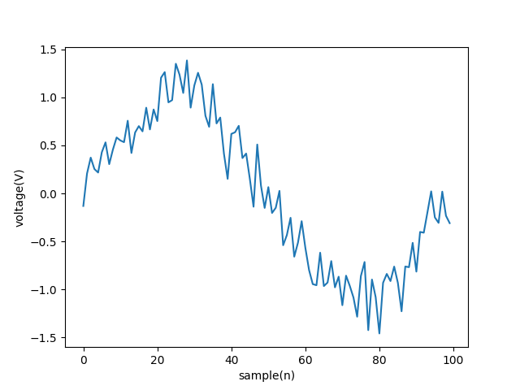

# KalmanFilter

Few weeks back I started learning Kalman filter for my work. Once I started, I struggled to find simple and inutitive tutorial or code base, which I could play with and learn. Hence, I decided to share my simple code, I created for learning. Hope this helps someone.

Description: The respository contains a simple kalman filter code and the filter is explained using a sin function sampling and noise.

# What the result might look like ?

                  Sin Function with Noise
  

                  Sin Function Kalman filtered 
  


# Depedency
  
  ```
    opencv
    numpy
    matplotlib
  ```
